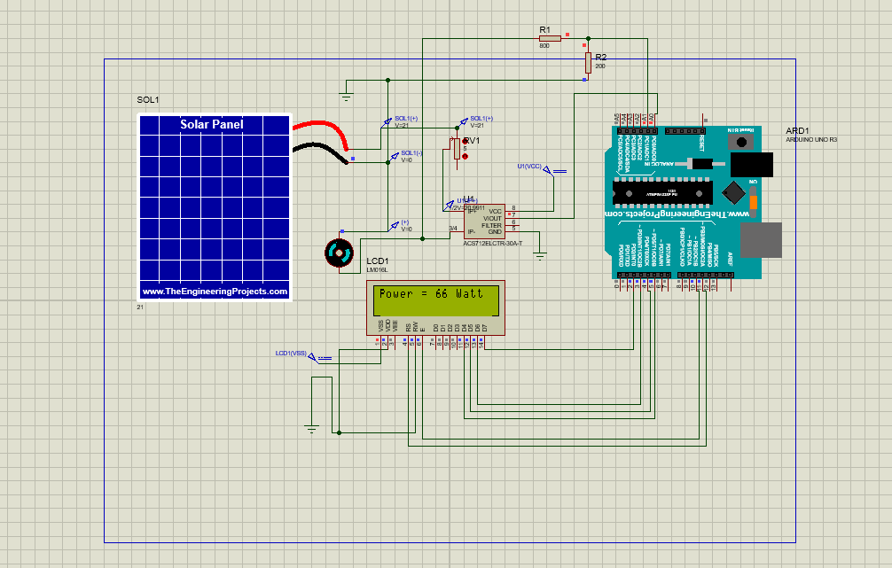

# Data_acquisition_of_solar_PV_pannel

A brief description of what this project :

## Aims & Objectives
• To simulate the solar panel system using MATLAB Simulink

• To implement the hardware system required for demonstrating
  the solar panel system

• To measure the various parameters such as generated voltage,
  current, lux, and power

•To compare the real time data with simulated results

## Proteus Simulation

